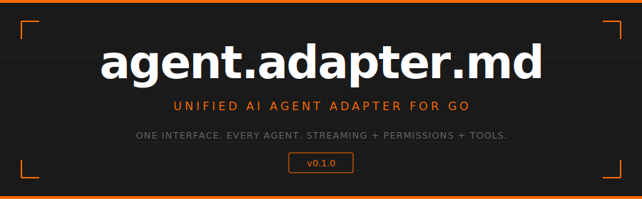

<p align="center">
  
</p>

<p align="center">
  <code>go get github.com/readmedotmd/agent.adapter.md</code>
</p>

---

## What is this?

A **single Go interface** for driving **any AI coding agent** — Claude Code, Codex CLI, Aider, or your own — from a web UI, TUI, or automation pipeline. Write your frontend once. Swap agents without changing a line.

```go
type Adapter interface {
    Start(ctx context.Context, cfg AdapterConfig) error
    Send(ctx context.Context, msg Message, opts ...SendOption) error
    Cancel() error
    Receive() <-chan StreamEvent
    Stop() error
    Status() AdapterStatus
    Capabilities() AdapterCapabilities
    Health(ctx context.Context) error
}
```

Every adapter speaks the same language: **structured messages in, streaming events out**.

> [Getting started &rarr;](./docs/getting-started.md)

---

## Features

<table>
<tr>
  <td width="200"><strong>Streaming events</strong></td>
  <td>Token-by-token output, thinking, tool calls, file changes, cost updates — all through a single <code>&lt;-chan StreamEvent</code></td>
</tr>
<tr>
  <td><strong>Permission flow</strong></td>
  <td>Agents request approval before running tools. Your UI prompts the user. You respond. No auto-accept required.</td>
</tr>
<tr>
  <td><strong>Multi-modal messages</strong></td>
  <td>Content blocks: text, code, images, files, tool calls — all in one message. No more flattening to strings.</td>
</tr>
<tr>
  <td><strong>Capability discovery</strong></td>
  <td>Query what each adapter supports (streaming, images, MCP, thinking, sub-agents) and build your UI accordingly.</td>
</tr>
<tr>
  <td><strong>Per-turn options</strong></td>
  <td>Override max tokens, temperature, stop sequences, or allowed tools on any individual send.</td>
</tr>
<tr>
  <td><strong>MCP servers</strong></td>
  <td>Attach MCP stdio servers to any adapter with a single config entry.</td>
</tr>
<tr>
  <td><strong>Sub-agents</strong></td>
  <td>Define and track sub-agent delegation with full lifecycle events.</td>
</tr>
<tr>
  <td><strong>Session management</strong></td>
  <td>Resume conversations, list history, fork sessions — via optional interfaces.</td>
</tr>
<tr>
  <td><strong>Typed errors</strong></td>
  <td>Distinguish crashed / rate-limited / context-too-long / auth / timeout / cancelled / permission-denied.</td>
</tr>
<tr>
  <td><strong>Cost tracking</strong></td>
  <td>Input tokens, output tokens, cache hits, estimated USD — per turn or per session.</td>
</tr>
</table>

> [Streaming events &rarr;](./docs/streaming.md) · [Permission flow &rarr;](./docs/permissions.md)

---

## Quick Start

```go
package main

import (
    "context"
    "fmt"
    "time"

    ai "github.com/readmedotmd/agent.adapter.md"
)

func main() {
    // Use any adapter that implements the interface
    var agent ai.Adapter = NewClaudeCodeAdapter()

    ctx := context.Background()

    err := agent.Start(ctx, ai.AdapterConfig{
        Name:    "claude-code",
        WorkDir: "/home/user/project",
        Model:   "claude-sonnet-4-6",
        PermissionMode: ai.PermissionDefault,
    })
    if err != nil {
        panic(err)
    }
    defer agent.Stop()

    // Send a message
    agent.Send(ctx, ai.Message{
        ID:        "msg-1",
        Role:      ai.RoleUser,
        Content:   ai.TextContent("Add error handling to the login endpoint"),
        Timestamp: time.Now(),
    })

    // Stream the response
    for ev := range agent.Receive() {
        switch ev.Type {
        case ai.EventToken:
            fmt.Print(ev.Token)
        case ai.EventToolUse:
            fmt.Printf("\n[tool: %s]\n", ev.ToolName)
        case ai.EventPermissionRequest:
            fmt.Printf("\n[permission: %s — %s]\n", ev.Permission.ToolName, ev.Permission.Description)
            // respond via PermissionResponder interface
        case ai.EventCostUpdate:
            fmt.Printf("\n[cost: $%.4f]\n", ev.Usage.TotalCost)
        case ai.EventDone:
            fmt.Println("\n--- done ---")
        case ai.EventError:
            fmt.Printf("\nerror: %v\n", ev.Error)
        }
    }
}
```

> [Full walkthrough &rarr;](./docs/getting-started.md)

---

## Permission Flow

Agents like Claude Code ask for approval before running tools. The adapter surfaces these as events, and your UI decides.

```go
for ev := range agent.Receive() {
    if ev.Type == ai.EventPermissionRequest {
        // Show the user what the agent wants to do
        approved := promptUser(ev.Permission.Description)

        // Respond (if the adapter supports it)
        if pr, ok := agent.(ai.PermissionResponder); ok {
            pr.RespondPermission(ctx, ev.Permission.ToolCallID, approved)
        }
    }
}
```

Three modes via config:

| Mode | Behaviour |
|------|-----------|
| `PermissionDefault` | Agent asks, UI decides |
| `PermissionAcceptAll` | Auto-approve everything |
| `PermissionPlan` | Read-only — agent can plan but not execute |

> [Permission details &rarr;](./docs/permissions.md)

---

## Streaming Events

Everything comes through `<-chan StreamEvent`. Each event has a `Type`, a `Timestamp`, and type-specific fields.

| Event | What it carries |
|-------|----------------|
| `EventToken` | `.Token` — incremental text output |
| `EventThinking` | `.Thinking` — model reasoning (extended thinking) |
| `EventToolUse` | `.ToolCallID`, `.ToolName`, `.ToolInput` |
| `EventToolResult` | `.ToolCallID`, `.ToolOutput`, `.ToolStatus` |
| `EventPermissionRequest` | `.Permission` — tool call awaiting approval |
| `EventFileChange` | `.FileChange` — created / edited / deleted / renamed |
| `EventSubAgent` | `.SubAgent` — sub-agent started / completed / failed |
| `EventCostUpdate` | `.Usage` — token counts and estimated cost |
| `EventProgress` | `.ProgressPct`, `.ProgressMsg` |
| `EventDone` | Turn complete |
| `EventError` | `.Error` — typed `*AdapterError` |
| `EventSystem` | `.Message` — system-level notifications |

> [Streaming details &rarr;](./docs/streaming.md)

---

## Capability Discovery

Different agents support different features. Query before you render.

```go
caps := agent.Capabilities()

if caps.SupportsThinking {
    showThinkingPanel()
}
if caps.SupportsImages {
    enableImageUpload()
}
if !caps.SupportsCancellation {
    disableCancelButton()
}

fmt.Println("Models:", caps.SupportedModels)
fmt.Println("Context window:", caps.MaxContextWindow)
```

> [Adapter capabilities &rarr;](./docs/adapters.md)

---

## Optional Interfaces

The core `Adapter` interface is deliberately small. Extended capabilities are opt-in — check with a type assertion.

```go
// Resume a previous conversation
if cm, ok := agent.(ai.ConversationManager); ok {
    convos, _ := cm.ListConversations(ctx)
    cm.ResumeConversation(ctx, convos[0].ID)
}

// Get conversation history
if hp, ok := agent.(ai.HistoryProvider); ok {
    messages, _ := hp.GetHistory(ctx)
}

// React to status changes without polling
if sl, ok := agent.(ai.StatusListener); ok {
    sl.OnStatusChange(func(s ai.AdapterStatus) {
        updateStatusIndicator(s)
    })
}
```

| Interface | Methods |
|-----------|---------|
| `SessionProvider` | `SessionID() string` |
| `HistoryClearer` | `ClearHistory(ctx) error` |
| `HistoryProvider` | `GetHistory(ctx) ([]Message, error)` |
| `ConversationManager` | `ListConversations(ctx)`, `ResumeConversation(ctx, id)` |
| `PermissionResponder` | `RespondPermission(ctx, toolCallID, approved)` |
| `StatusListener` | `OnStatusChange(fn)` |

> [Building adapters &rarr;](./docs/adapters.md)

---

## Project Structure

```
adapter.go     Core interface, config, capabilities, errors, optional interfaces
message.go     Message, ContentBlock, ToolCall, Conversation
stream.go      StreamEvent, event types, TokenUsage, FileChange, PermissionRequest
```

---

<p align="center">
  <sub>Built by <a href="https://github.com/readmedotmd">readme.md</a> · MIT License</sub>
</p>
